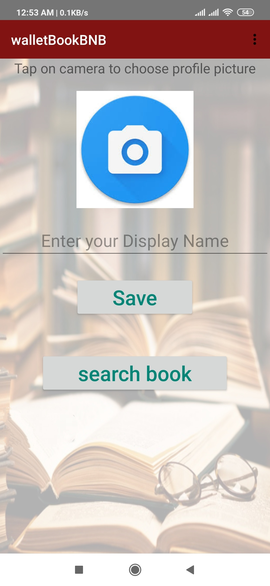
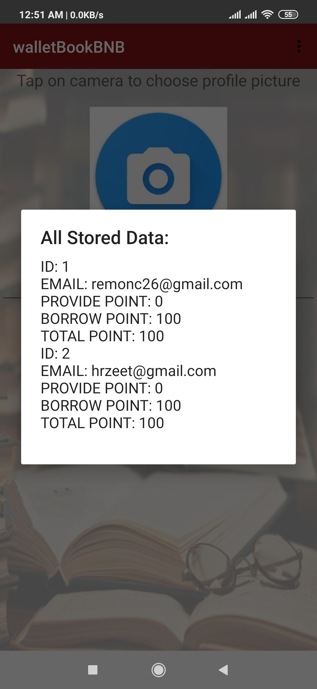
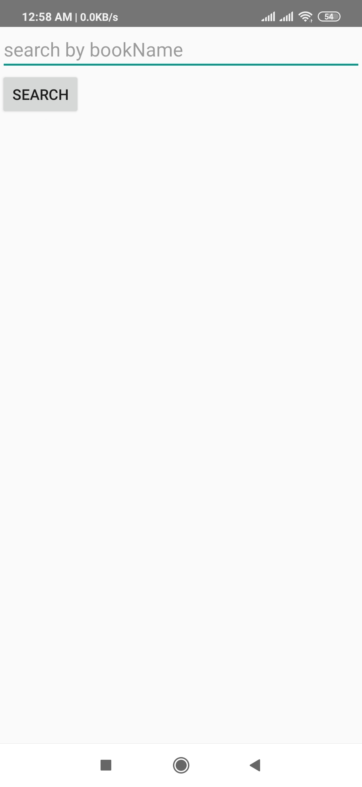

# Software-Engineering-Project(Online Book Sharing System)
This project is developed during the Undergrad CSE Course **"Software Engineering"** under the supervision of **Dr.Musfique Anwar**.The Goal of the project was to build a Native Android Application following standard software engineering methodologies and techniques which aims to provide different features for the bookworms at free of cost like 
borrow books,search books,provide books,review on books,having notifications for latest features etc.
## Methodology we used:
We followed **Agile Methodology** here,Divided the whole task into 3 sprints and each sprint length was 1 week to complete.
Before the beginning of the project,we have our **Scrum Master**,project owner selected.We held meetings weekly,Documented the Meeting records and worked accordingly.
## Tasks we worked on:

- Made **User Story**
- Documented **PDD(Project Design Document)**,**PDT(Project Design Template)**,Vision Statement,**Product Vision Board** etc.
- Designed UI for the application
- Designed Database 
- Set Coding Standard for the project
- Analyzed advantage and disadvantages of 4 diff types of **Continuous Integration** and **Unit Testing tool**
- Generated Documentation

## Tools we Used:
**Project Type :** Native Android Application   
**IDE :** Android Studio  

**Software Management Platform :**
 - Trello(https://trello.com/b/xHHf4sAK/walletbookbnb) for task management
 - Slack(to join send email- hremon62@gmail.com) for communication purpose
 - Toggl for time tracking
## Some of the Features :

|Sign Up | Profile | Login |
------------ | ------------- | -----
  |  |  
 | Features | Info | Search |
  |  | 

*Feature List* 

- Sign Up
- Login
- Search Book
- Borrow Book
- Return Book
- Provide Book
- Checking Ratio Points
- Giving Away
- Review
- Push Notifications
## Team Details:
Member 1:  
Name: **Md.Habibur Rahman**  
Role: Team Lead & Project Manager  
Mail:remondc26@gmail.com  
Class Roll:40  
Member 2:  
Name:**Nabilah Hossain Sarker**  
Role:UI Designer   
Mail:haliban256@gmail.com  
Class Roll:21  
Member 3:  
Name : **Shifat Ara Rafiq**  
Role: UX Designer  
Mail:sifat.prova@gmail.com  
Class Roll:08  
Member 4:  
Name: **Tasnim Tabassum Shimi**  
Role:Quality Assurance Manager  
Mail:tasnimtabassum16@gmail.com  
Class Roll:18  
